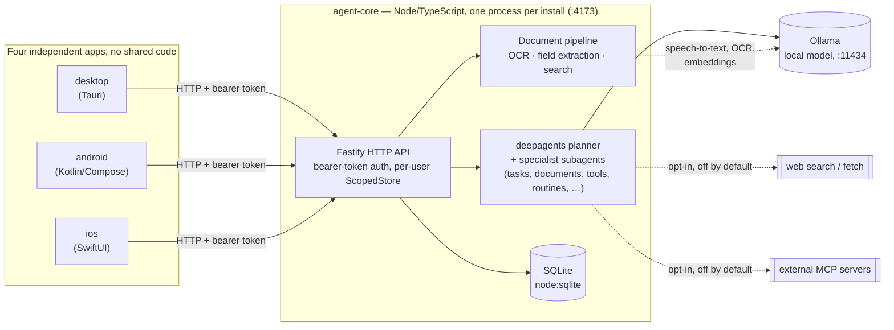

<p align="center">
  
</p>

<p align="center">
  <a href="https://github.com/tianhaoz95/family-agent/actions/workflows/ci.yml"></a>
  <a href="https://github.com/tianhaoz95/family-agent/actions/workflows/release-mac.yml"></a>
  <a href="https://github.com/tianhaoz95/family-agent/actions/workflows/release-linux.yml"></a>
  <a href="https://github.com/tianhaoz95/family-agent/actions/workflows/release-linux.yml"></a>
  <a href="https://github.com/tianhaoz95/family-agent/actions/workflows/release-windows.yml"></a>
  <a href="https://github.com/tianhaoz95/family-agent/actions/workflows/release-windows.yml"></a>
  <a href="https://github.com/tianhaoz95/family-agent/actions/workflows/release-ios.yml"></a>
  <a href="https://github.com/tianhaoz95/family-agent/actions/workflows/pages.yml"></a>
</p>

A local-first agentic app for a household's documents, calendar, tasks, notes
and passwords. Everything — the model, the storage, the document and speech
processing — runs on hardware you own. There's no account to create and no
service to trust, because the server is the laptop in your house.

<p align="center">
  
</p>

It's **multi-user**. The home laptop runs the master node; an admin does a
one-time setup and creates a local account per family member. Each account has
its own isolated tasks, documents, chat history, tools and watched folder.
Clients sign in with a username + password and the phone apps find the server
on the LAN automatically (mDNS, plus a QR you can scan from the desktop). The
things that are *shared* are shared on purpose: family chat (1:1 DMs and
group channels, with `@agent` pulling the assistant in), a shared sticky-note
board, and a password vault you can open to the household.

Four apps share one HTTP backend:

- **agent-core** — a Node/TypeScript service that runs a local LLM-backed
  planner (via [deepagents](https://github.com/langchain-ai/deepagentsjs))
  behind a small HTTP API, backed by SQLite and a local Ollama instance.
- **desktop** — a [Tauri](https://tauri.app) app that spawns agent-core as a
  sidecar and gives it a UI. Ships for macOS (`.dmg`, signed + notarized, with
  agent-core and a Node runtime bundled and a built-in auto-updater); builds
  on Linux too (`.deb`/`.AppImage`).
- **android** — a native Kotlin/Compose companion app.
- **ios** — a native SwiftUI companion app with feature parity, Apple Liquid
  Glass on iOS 26 and a `.ultraThinMaterial` fallback to iOS 18. See
  [`ios/README.md`](ios/README.md).

The types on the wire are duplicated by hand in each client rather than shared
through a package — the four apps have no shared code.

**[Download for macOS →](https://github.com/tianhaoz95/family-agent/releases/latest)** · [family-agent site](https://tianhaoz95.github.io/family-agent/)

This is a working prototype, not a finished product — see
[**docs/STATUS.md**](docs/STATUS.md) for what's verified vs. not,
[**docs/DECISIONS.md**](docs/DECISIONS.md) for the reasoning (and the mistakes)
behind every non-obvious choice, and [**CLAUDE.md**](CLAUDE.md) for the full
architecture reference.

## How it's put together

<p align="center">
  
</p>

For a closer look at what's inside **agent-core** itself — the one piece all
four clients share — here's the same picture one level deeper:



Everything lives behind that one HTTP boundary: a client never talks to
Ollama, SQLite, or the filesystem directly — only agent-core does, which is
what keeps "local-first" actually true regardless of which client you're
looking at. Start reading at `agent-core/src/server.ts` (the route table) and
`agent-core/src/agents/index.ts` (the planner + subagents) — the rest of this
section, and `CLAUDE.md`, go a layer deeper from there.

**agent-core** is the only thing that talks to a model or touches the
filesystem. It owns:

- **A planner and ten specialist subagents** (`agents/index.ts`). The planner
  delegates rather than acting on domain requests itself:
  `task-agent` (to-dos and reminders), `document-agent` (search and read
  documents, extract fields), `builder-agent` (generate a small web tool),
  `notes-agent` (the sticky board), `tools-agent` (use a tool the family
  built), `routine-agent` (scheduled instructions), plus — when the operator
  turns them on — `research-agent` (web search), `workshop-agent` (run CLI
  tools over a file), `skill-agent` (taught playbooks) and `connections-agent`
  (external MCP servers). Leaf tools sit directly on the planner too:
  `run_code` (a sandboxed JS snippet for exact arithmetic/date math),
  `render_card` (an inline chart/checklist) and `render_artifact` (a whole
  generated page, browsable in an Artifacts tab). Password/2FA lookups are a
  separate forced-turn agent, never in the planner's reach. The prompts carry
  worked examples, not just instructions — abstract prompting alone wasn't
  reliable against small-model failure modes.
- **A local-by-default model policy.** Every agent runs against Ollama
  (`gemma4:e2b` by default; `FAMILY_AGENT_MODEL` picks another). There is no
  cloud fallback wired anywhere. Speech-to-text (Whisper), text-to-speech
  (Kokoro) and the optional embedding model for semantic document search all
  run in-process or through the same local Ollama.
- **Document ingestion, three ways into one pipeline:** paste text
  (`POST /documents/ingest`), upload a PDF / photo / scan
  (`POST /documents/upload`), or drop a file into a per-user watched folder
  (`inboxWatcher.ts`, chokidar). PDFs use the text layer when there is one and
  OCR the page images when there isn't; photos and scans go through OCR
  (`tesseract.js`, or an Ollama vision model if configured). Field extraction
  (category, summary, important dates) is a single tool bound straight to the
  model — deliberately *not* routed through the planner, after a small model
  garbled a document id doing that. Search is keyword (FTS5), typo-tolerant
  (trigram) and by-meaning (local embeddings), merged.
- **Local accounts + sessions** (`auth.ts`) — scrypt-hashed passwords, opaque
  bearer tokens (only the sha256 is stored). A `preHandler` hook scopes every
  query to the caller via a `ScopedStore` (`WHERE user_id = ?`); one planner
  and one watched folder per account. Phone pairing can carry a single-use,
  5-minute token in the QR so a scan signs straight in.
- **Cross-account chat and a shared board** — the only data that isn't
  per-account, added narrowly rather than by loosening the scoping boundary.
- **Scheduled routines** — a saved instruction the assistant runs on a cron /
  interval / one-off schedule (a morning briefing, a bill nudge), with catch-up
  after downtime. A routine can never run the code-builder unattended.
- **Generated tools** — `builder-agent` writes a small self-contained web tool
  (a checklist, a tracker, a budget splitter); static ones are inline HTML
  under a strict CSP, backed ones get a Deno process in a deny-by-default
  sandbox with a private SQLite database. Tools are improved in place, with a
  one-step revert.
- **LAN discovery + an activity log.** The node advertises over mDNS
  (`_familyagent._tcp`) and binds `0.0.0.0`; `FAMILY_AGENT_MDNS=0` turns that
  off. Every mutating action writes its own audit-log row, so the log can't
  drift from what happened.

The clients are thin HTTP wrappers over that API — Chat, Events, Messages,
Board, Documents, Tools, Artifacts, Routines, Skills, Connections, Vault,
Activity, Settings, and (admin only) a Family screen — health-gating the
screens for capabilities the server has turned off. First launch shows setup
(desktop) or discovery + login (phones).

## Prerequisites

- **Node.js 22.5+** (uses `node:sqlite` — no native module build) and **Rust +
  Cargo** for the Tauri desktop app.
- **[Ollama](https://ollama.com)** running locally with the model pulled:
  ```bash
  ollama serve &
  ollama pull gemma4:e2b
  ```
  The model must support tool-calling in Ollama's serving layer — a property
  of the specific model, not something this app can route around. Optionally
  `ollama pull nomic-embed-text` to enable by-meaning document search (it
  falls back to keyword + fuzzy without it).
- **Xcode 16+** with an iOS 18+ simulator, only for the iOS app.
- **Android toolchain** (JDK 17 + Android SDK), only for the Android app.
  `.toolchains/` at the repo root holds a machine-local, gitignored copy if
  you've set one up; `docs/BUILD_LOG.md` has how to install one without root.
- *Optional, off by default:* `bubblewrap` + CLI tools (`ffmpeg`, `qpdf`,
  `imagemagick`, …) for the file-processing capability; a web-search provider
  for the research capability. See `CLAUDE.md`.

## Running it

**Easiest path** — launcher scripts from the repo root, each does its own
readiness checks:

```bash
./scripts/start-desktop.sh   # rebuilds agent-core, launches the Tauri app (Linux or macOS)
./scripts/start-android.sh   # detects/boots an emulator, builds, installs, launches
./scripts/start-ios.sh       # boots an iOS simulator, builds, installs, launches
./scripts/show-accounts.sh   # prints local accounts (for a forgotten admin username)
./scripts/reset-password.sh <username> [password]   # for a locked-out admin
```

**Manual path**, piece by piece:

```bash
# agent-core (build once, or `npm run dev` for live reload)
cd agent-core && npm install && npm run build && npm start

# Desktop app — spawns agent-core itself, no need to start it separately
cd desktop && npm install && npm run tauri:dev
#   or: npm run tauri:build       → .deb/.AppImage/.dmg in src-tauri/target/release/bundle

# Android
cd android
export JAVA_HOME=$(pwd)/../.toolchains/jdk17
export ANDROID_HOME=$(pwd)/../.toolchains/android-sdk
./gradlew installDebug            # needs a connected device/emulator (adb devices)

# iOS
cd ios && xcodebuild -project FamilyAgent.xcodeproj -scheme FamilyAgent \
  -destination 'platform=iOS Simulator,name=iPhone 17 Pro' build
```

**First launch:**

- **desktop** shows a setup screen (create the owner/admin account, name the
  home). Add family members from the **Family** screen; pair their phones from
  **Settings → Pair a phone**.
- **android / ios** discover the master node on the LAN and show a login
  screen — or scan the pairing QR. If discovery misses it (some networks block
  mDNS), enter the address by hand: `http://<lan-ip>:4173`, or
  `http://10.0.2.2:4173` / `http://localhost:4173` from an emulator/simulator.
- A dev/test server can be bootstrapped directly:
  ```bash
  curl -XPOST localhost:4173/auth/bootstrap -H 'content-type: application/json' \
    -d '{"username":"me","displayName":"Me","password":"secret123"}'
  ```

The SQLite database, per-user inbox folders, cached models (OCR / ASR / TTS /
embeddings) and `settings.json` all live under `$XDG_DATA_HOME/family-agent`
(`~/.local/share/family-agent`) — **not** the repo tree.
`FAMILY_AGENT_DATA_DIR` overrides it; use a throwaway dir for any manual
testing so you never touch a real install.

## Testing

```bash
npm test                                    # repo root: agent-core, then desktop
cd android && ./gradlew testDebugUnitTest   # Android unit tests, no device needed
```

`agent-core`'s suite has two tiers: fast unit tests (SQLite storage, HTTP
routes, file extraction, auth, cards/artifacts/pairing, …) and slower
live-model integration tests that make real calls to Ollama. The integration
tests **skip themselves** when the configured model isn't reachable, so
`npm test` stays green without Ollama — just with fewer tests run. Several real
bugs in this codebase were only ever caught by the live-model tests; small
local models are unreliable enough that prompt/tool-wiring bugs routinely don't
show up in the fast tests.

## What's local — and the exceptions

Nothing about your data leaves the machine. The exceptions are all either
one-time or opt-in, and none of them send your documents anywhere:

- **One-time model downloads.** The first OCR / speech / TTS / embedding call
  pulls its model (a few MB to ~90 MB) from a public CDN and caches it under
  the data dir; every call after that is fully offline.
- **Web search** (`research-agent`) is **off by default**. An admin turns it
  on in Settings; it's SSRF-guarded, never follows a redirect, and logs every
  request in Activity.
- **External MCP servers** (`connections-agent`) and **file processing**
  (`workshop-agent`) are **off unless an operator sets an env var**. The file
  sandbox has no network at all.

## What's not built yet

The original brainstorm describes more than what's here: a compute mesh across
family devices, a Tailscale/relay transport for the phone apps, and a
bundled/managed local-model runtime so Ollama isn't a separate install. None
of that exists. Full reasoning for every scope cut is in `docs/DECISIONS.md`.
